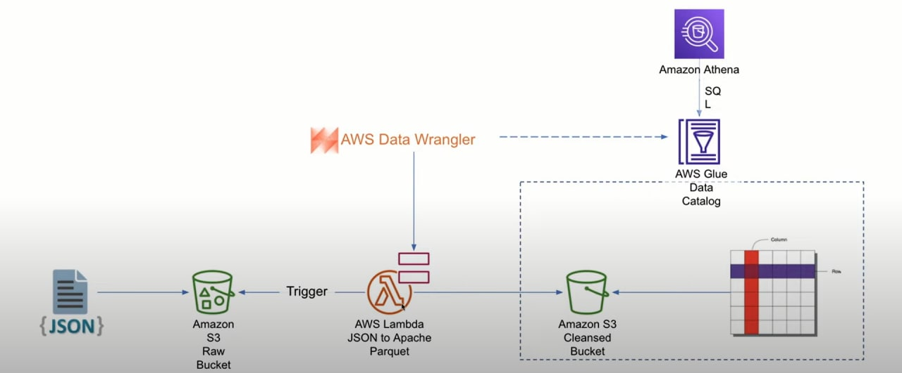
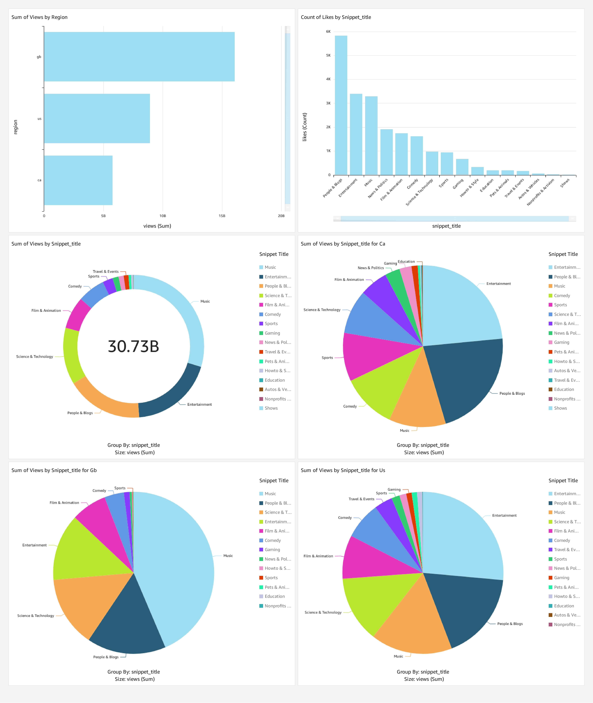

# Data-Engineering-YouTube-Analysis-Project

## Project Overview

Our project aims to securely manage, streamline, and analyze structured and semi-structured YouTube video data from three countries: the USA, Great Britain, and Canada. The primary focus is on video categories and trending metrics.

## Project Goals

1. **Data Ingestion:** Develop a robust mechanism to ingest data from various sources.

2. **ETL System:** Implement an ETL (Extract, Transform, Load) system to process raw data into the required format.

3. **Data Lake:** Create a centralized repository (data lake) to store data from multiple sources efficiently.

4. **Scalability:** Ensure the system is scalable to handle increasing data volumes effectively.

5. **Cloud Integration:** Utilize cloud services, specifically AWS (Amazon Web Services), to process and manage large datasets.

6. **Reporting:** Design and build a user-friendly dashboard to extract meaningful insights and answers to predefined questions from the processed data.

These project goals collectively aim to establish a data pipeline that can efficiently handle, process, and analyze large datasets from diverse sources while ensuring scalability and ease of reporting through cloud-based infrastructure.

## Architecture Diagram
   

## Services Used

1. **Amazon S3 (Simple Storage Service):** Amazon S3 is an object storage service known for its manufacturing scalability, data availability, security, and performance.

2. **AWS IAM (Identity and Access Management):** AWS IAM is a critical component for managing access to AWS services and resources securely, ensuring proper authentication and authorization.

3. **Amazon QuickSight:** Amazon QuickSight is a scalable, serverless, machine learning-powered business intelligence (BI) service designed for the cloud. It facilitates data visualization and reporting.

4. **AWS Glue:** AWS Glue is a serverless data integration service that simplifies the process of discovering, preparing, and combining data for various purposes, including analytics, machine learning, and application development.

5. **AWS Lambda:** AWS Lambda is a serverless computing service that enables developers to run code without the need to manage servers. It's used for executing code in response to specific events.

6. **AWS Athena:** AWS Athena is an interactive query service designed for data stored in Amazon S3. It allows users to query data without the need to load it into a separate database; the data remains in S3, making it an efficient choice for querying large datasets.

These services are integral to our project and will collectively support our data processing, storage, analysis, and reporting needs in an efficient and scalable manner.

## Dataset Used
This Kaggle dataset contains statistics (CSV files) on daily popular YouTube videos over the course of many months. There are up to 200 trending videos published every day for many locations. The data for each region is in its own file. The video title, channel title, publication time, tags, views, likes and dislikes, description, and comment count are among the items included in the data. A category_id field, which differs by area, is also included in the JSON file linked to the region.

https://www.kaggle.com/datasets/datasnaek/youtube-new

## Project Execution Flow

**Step 1: Data Ingestion**
Create an S3 Bucket for Raw Data.
Upload YouTube data to the S3 bucket using the AWS CLI for efficient data partitioning and organization.

**Step 2: Data Catalog and Initial Processing**

Utilize AWS Glue Data Catalog to establish a catalog for data.
Implement a crawler to catalog both CSV and JSON files.
The catalog output feeds into Amazon Athena, where tables within a database are created for data exploration.

**Step 3: Data Pre-processing**

Identify errors in the JSON format (SerDe) file structures.
Develop an AWS Lambda function to preprocess and convert JSON files to Parquet format.
Configure Lambda to trigger automatically upon data uploads to the S3 bucket.
The processed data is stored in a separate S3 bucket and an associated Athena database, allowing schema and data type validation.

**Step 4: ETL Processing for CSV Data**

Convert CSV files to Parquet format.
Employ AWS Glue ETL job to further process and clean the data.
Store the cleaned data in a designated S3 bucket.

**Step 5: Additional Data Catalog and Database**

Create a second AWS Glue Data Catalog crawler to catalog the cleaned data.
Populate a second database with cataloged tables.

**Step 6: Data Integration and Final Preparation**

Build a new ETL job in AWS Glue to combine and join the cleaned tables.
Store the integrated data in the final S3 bucket, ready for analytics.

**Step 7: Analytics and Utilization**

The prepared data is now available for various applications, including dashboard reporting and machine learning models.

Create a dashboard using AWS QuickSight for data visualization and analysis.

## Key Questions Addressed by the Dashboard

The dashboard is designed to address the following key questions:

**Which country had more views?** - The dashboard will display comparative views data for the USA, Great Britain, and Canada, allowing users to determine which country had the highest views.

**Which video category had more views?** - Users can explore the data to identify which video categories garnered the most views.

**How did the views differ per category for the different regions?** - The dashboard provides a region-wise breakdown of views across different video categories, enabling users to understand variations in viewership.

